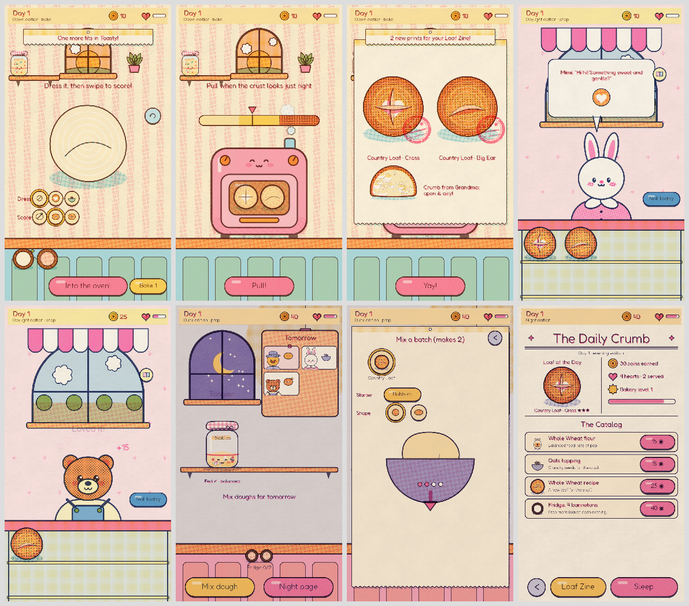

# Proof 🍞

**A tiny, very cute sourdough bakery printed on a risograph.**

In Proof you look after sourdough starters that are little pets. You prep dough every evening, score your loaves with a blade each morning, and sell them to a gang of animal regulars. Everything is drawn as if hand-printed in four spot inks, with halftone blush, overprinted colours, paper grain and ink that slips slightly out of register.



- **Rust does almost everything:** the rules, simulation, gestures, scoring, all procedural art (there are no image files), the rasteriser, and the sound synth.
- **Godot 4.7 does the rest:** the window, input, text, audio output and mobile export. There is zero GDScript.

## The loop

| ☀️ Morning — bake | 🏪 Day — shop | 🌙 Evening — prep |
|---|---|---|
| Peek at the jars to see how much they rose overnight | Regulars visit with icon orders | Feed each starter: pick a flour, then stir in circles |
| Dust a flour stencil and sprinkle seeds | Tap or drag a goodie onto them | Read tomorrow's board and pinned pre-orders |
| **Score with freehand swipes** | Hearts, tips and keepsake gifts | Mix a batch: pick a recipe, a starter and a shape, then do 4 stretch-and-fold swipes |
| Pull from Toasty the oven at your preferred crust | Sold out? They leave a pre-order | *The Daily Crumb*: the catalog, your Loaf Zine, then sleep |
| The cuts bloom open, a stamp thunks down, and you see the crumb | | |

- **Starters** have two hidden stats, **Pep** (rise) and **Tang** (flavour). You can see them in the jar as pink *Yeasties* and blue *Lactos*.
- **Rye flour makes a starter tangier, and white flour makes it milder.** Customers notice the difference.
- A starter you forget gets a hooch layer and a sleepy face, but **it can never die**.
- Every feed leaves a spoon of discard. Two spoons make a tray of muffins, cinnamon buns or bagels.

See **[docs/DESIGN.md](docs/DESIGN.md)** for the full design, the research it builds on (Cooking Mama, Papa's games, Good Pizza Great Pizza, Neko Atsume, Stardew, and more) and the art direction.

## Repository layout

```
rust/                       Cargo workspace
  crates/proof_core/        rules, sim, gestures, scoring, procedural art (DrawLists), synth — pure Rust
  crates/proof_raster/      tiny-skia rasteriser: DrawList → four-ink plate texture
  crates/proof_gd/          gdext bridge: the Game node, screens, riso textures, audio
  crates/proof_tools/       artboard (PNG sheets + app icon), autoplay balance runner, contact sheets
godot/                      Godot project (main.tscn, shaders, font, export presets)
scripts/                    build, tour (screenshots), smoke test, Android/iOS builds, Godot fetch
docs/DESIGN.md              game design document
```

## Build and run (desktop)

You need Rust **1.94+** and **Godot 4.7.x** (the scripts use 4.7.2).

```bash
scripts/fetch-godot.sh          # optional: downloads Godot 4.7.2 (Linux) into .tools/
scripts/build.sh                # builds the Rust extension → godot/bin/<os>/
.tools/godot --path godot       # or open godot/project.godot in the editor and press Play
```

On desktop the mouse acts as a finger (touch emulation is on). Launch flags go after `--`:

| Flag | What it does |
|---|---|
| `--fresh` | Ignore the save and start a new bakery |
| `--seed=N` | Use a deterministic seed |
| `--autoplay=N` | Play N days headless (smoke test) |
| `--tour --days=N --shots=DIR` | Walk the loop and screenshot every step |

## Checks

```bash
cd rust
cargo fmt --all --check && cargo clippy --workspace --all-targets -- -D warnings
cargo test --workspace                                   # 40+ tests: sim, scoring, raster, synth…
cargo run --release -p proof_tools --bin autoplay -- 30 20   # balance table: 30 days × 20 seeds
cargo run --release -p proof_tools --bin artboard -- ../out/artboard   # art review sheets
cd ..
scripts/smoke.sh 3              # headless Godot: autoplay 3 days through the real screens
scripts/tour.sh 2               # screenshots under Xvfb → out/tour/
```

CI (`.github/workflows/ci.yml`) runs the Rust checks, the balance run, the artboard render and the Godot smoke test.

## Mobile export

The game runs in portrait at 720×1280 reference units, with `canvas_items` stretch and `expand` aspect so it fills tall phones. It uses the Compatibility renderer (GLES3), which works on the widest range of phones.

**Android (arm64)**
1. Install the Android SDK, JDK 17 and **NDK r28+**. Point Godot's *Editor Settings → Export → Android* at them, and install the 4.7.2 export templates.
2. Install `cargo-ndk` and set `ANDROID_NDK_HOME`.
3. Run `scripts/build-android.sh --export`. It cross-compiles `libproof.so` with 16 KB page alignment (required by Google Play) into `godot/bin/android/arm64/`, then exports `build/proof.apk` with the *Android* preset.

**iOS** (needs macOS with Xcode)
1. Run `scripts/build-ios.sh` to build `libproof.ios.framework`.
2. Export the *iOS* preset from Godot and open the Xcode project.
3. Caveats: iOS support in godot-rust is community-maintained, and some Godot 4.7.x iOS exports need small linker workarounds (see the Godot issue tracker).

## Credits

- Font: [Fredoka](https://github.com/hafontia/Fredoka-One) by The Fredoka Project Authors, SIL Open Font License (`godot/fonts/OFL.txt`).
- Built with [Godot Engine](https://godotengine.org), [godot-rust (gdext)](https://github.com/godot-rust/gdext) and [tiny-skia](https://github.com/linebender/tiny-skia).
